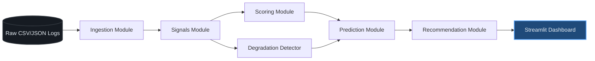
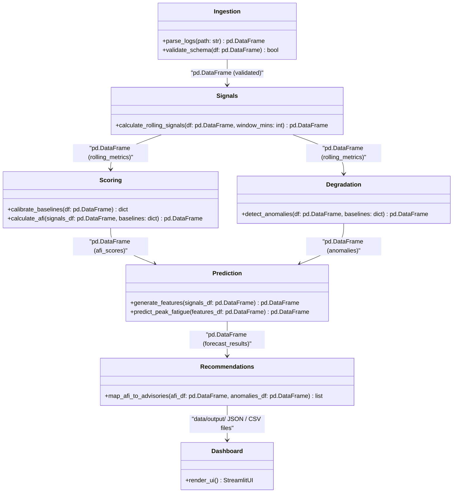

# System Architecture & Data Flow Design

This document details the modular software architecture, data boundaries, and processing pipeline for the **Alert Fatigue Quantifier (AFQ)**.

---

## 1. Pipeline Data Flow

The system is designed with a strict **one-way, acyclic data flow**. No feedback loops, sideways transitions, or circular imports are permitted. This ensures that every phase of the pipeline remains decoupled and testable in isolation.

---

## 2. Module Boundary and Interface Contracts

The system comprises seven modules. The table below defines the boundaries, input parameters, outputs, and the data types crossing each boundary.

### Module Inputs and Outputs

| Component Name | File Boundaries | Core Inputs | Core Outputs | Data Type Crossing Boundary |
| :--- | :--- | :--- | :--- | :--- |
| **Ingestion** | `ingestion/parser.py` `ingestion/validator.py` | Raw log file paths (`data/raw/*.csv` or `*.json`) | Validated DataFrame | `pd.DataFrame` with normalized field types |
| **Signals** | `signals/<signal_files>.py` `signals/rolling_window.py` | Validated DataFrame | Rolling 60-min window metrics | `pd.DataFrame` containing rolling signal values per analyst |
| **Scoring** | `scoring/normaliser.py` `scoring/afi_calculator.py` `scoring/baseline_calibrator.py` | Rolling signals and 30-day baseline dictionary | Stored AFI score histories | `pd.DataFrame` containing float AFI values in range `[0, 100]` |
| **Degradation** | `degradation/detector.py` `degradation/mann_whitney.py` | Ingested alert closure types and baseline metrics | Statistical anomaly flags | `pd.DataFrame` of anomalies with p-values from Mann-Whitney U test |
| **Prediction** | `prediction/model.py` `prediction/feature_engineering.py` `prediction/validator.py` | Historical AFI scores and time-series features | Impending fatigue risk forecasts | `pd.DataFrame` of predictions with binary flags (0 = normal, 1 = high risk) |
| **Recommendations** | `recommendations/engine.py` | Final AFI scores and anomaly/predictive warning flags | Advisory action text suggestions | `dict` containing structured advisory text mapping |
| **Dashboard** | `dashboard/app.py` `dashboard/components/*` | Stored pipeline outputs from `data/output/` | Streamlit browser view | Ingests `data/output/` JSON/CSV files; writes zero data |

---

## 3. Configuration Management (`config/settings.py`)

The configuration module `config/settings.py` is the **single source of truth** for all constants:
* It sits entirely outside the pipeline flow.
* It does not import or depend on any pipeline module.
* Every module that requires a constant (e.g., weights, thresholds, durations, paths) must import it directly from `config/settings.py`.
* No magic numbers are permitted in any other file.

---

## 4. The Dashboard Integration Boundary

Consistent with **Rule 1 (Scope)** and **Rule 4 (Architecture)**:
* The Streamlit dashboard (`dashboard/app.py`) is completely decoupled from the processing pipeline.
* The dashboard **never imports or runs** ingestion, scoring, prediction, or recommendation functions directly.
* The dashboard only reads pre-computed JSON and CSV files from `data/output/` at a configurable refresh interval.
* This read-only separation guarantees that dashboard execution cannot impact the performance of the alert pipeline.
