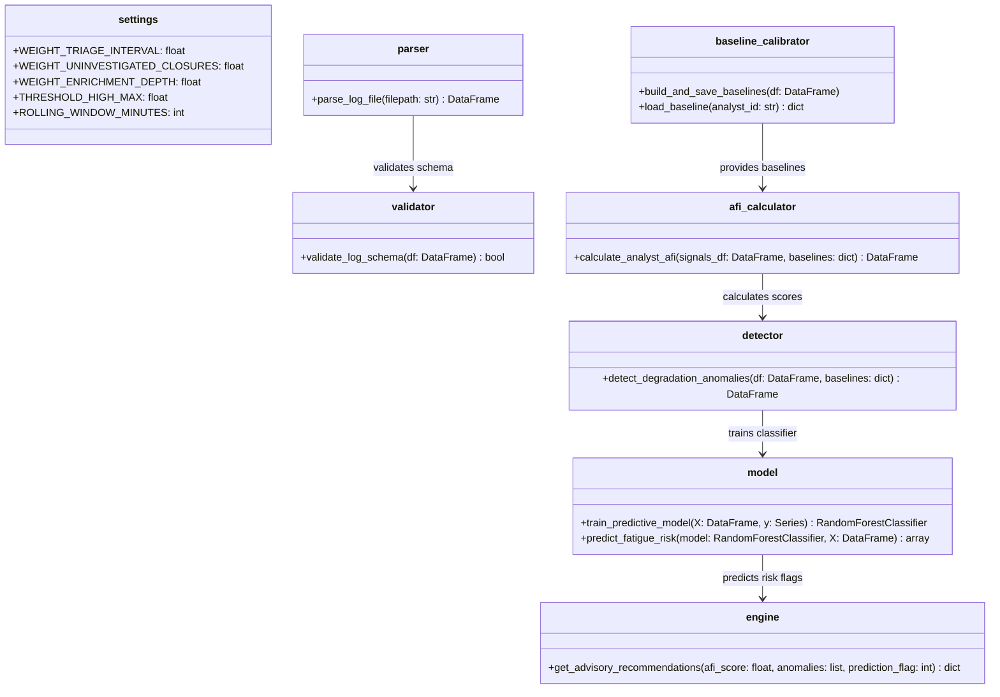

# Chapter 3: System Design and Methodology

The Alert Fatigue Quantifier (AFQ) processes interaction logs through a modular, single-direction pipeline. This chapter details the technical specifications, mathematical scoring models, statistical algorithms, machine learning configuration, and software design diagrams.

---

## 3.1 Pipeline Architecture & Data Flow

The system architecture prevents downstream dependencies from importing upstream components, ensuring a clean decoupling of logic. Data flows sequentially as follows:

```
[Raw CSV Interaction Logs]
             │
             ▼
1. Ingestion Module (parser.py + validator.py)
   Reads logs, validates fields, and parses timestamps.
             │
             ▼
2. Signal Engine (triage_interval.py, enrichment_depth.py, etc.)
   Computes rolling 60-minute window behavioral indicators.
             │
             ▼
3. Scoring & Anomaly Detection (normaliser.py + detector.py)
   Calibrates baselines, calculates AFI, and runs Mann-Whitney U tests.
             │
             ▼
4. Prediction Module (model.py + validator.py)
   Shapes feature matrices, handles cross-validation, and runs Random Forest.
             │
             ▼
5. Recommendations & Dashboard (engine.py + app.py)
   Maps metrics to guidelines and displays results on the Streamlit UI.
```

---

## 3.2 Ingestion & Schema Validation
The ingestion module reads CSV log exports and validates them against the target schema.
* **Validation Rules:**
  - `analyst_id` must follow the format `ANALYST_[0-9]{2}`.
  - `closure_timestamp` must be chronologically greater than or equal to `triage_timestamp`.
  - `enrichment_actions` must be a non-negative integer ($\ge 0$).
  - Missing text fields (e.g., empty `notes`) are automatically filled with empty strings `""` rather than raising null errors.

---

## 3.3 Rolling Window Signal Calculations
For any given alert closure at time $t$ by analyst $A$, the system calculates five behavioral signals over a rolling 60-minute window:
$$W(t) = \{r \in \text{Logs}_A \mid t - 60 \text{ minutes} < \text{closure\_timestamp}_r \le t\}$$

The signals are defined as:
1. **Triage Interval ($T_{\text{avg}}$):** The average duration (in seconds) between triage assignment and closure:
   $$T_{\text{avg}} = \frac{1}{|W(t)|} \sum_{r \in W(t)} (\text{closure\_timestamp}_r - \text{triage\_timestamp}_r)$$
2. **Uninvestigated Closures Ratio ($R_{\text{uninv}}$):** The ratio of alerts closed without notes and without enrichment:
   $$R_{\text{uninv}} = \frac{|\{r \in W(t) \mid \text{enrichment\_actions}_r = 0 \text{ and } \text{notes}_r = ""\}|}{|W(t)|}$$
3. **Enrichment Depth ($D_{\text{avg}}$):** The average number of threat intelligence actions per alert:
   $$D_{\text{avg}} = \frac{1}{|W(t)|} \sum_{r \in W(t)} \text{enrichment\_actions}_r$$
4. **Escalation Deviation ($E_{\text{dev}}$):** The shift in current window escalation rates compared to historical norms.
5. **Hourly Closure Rate ($C_{\text{rate}}$):** The total number of alerts closed by the analyst per hour.

---

## 3.4 Baseline Calibration & Normalisation Math

To prevent biasing metrics across analysts with different work rates, the system calibrates a 30-day baseline profile per analyst, containing the mean ($\mu$) and standard deviation ($\sigma$) of each signal.

### 3.4.1 Z-Score Normalisation
For a current signal value $X$, the deviation from baseline is computed as:
$$Z = \frac{X - \mu}{\sigma}$$
*Note: If $\sigma = 0$ (no historical variance), $Z$ is set to $0.0$.*

### 3.4.2 Sigmoid Scaling
To bound all inputs into a standardized $[0, 1]$ interval representing fatigue contribution, the Z-scores are mapped using a modified logistic sigmoid function:
$$S(Z) = \frac{1}{1 + e^{-k \cdot Z}}$$
For signals where lower values indicate fatigue (e.g., Enrichment Depth), the Z-score is negated before scaling ($Z \leftarrow -Z$) so that a drop in action depth scales toward $1.0$.

---

## 3.5 Analyst Fatigue Index (AFI) Score Formula
The composite **Analyst Fatigue Index (AFI)** (0 to 100) is calculated as a weighted sum of the five normalized, sigmoid-scaled signals:
$$\text{AFI} = 100 \times \sum_{i=1}^{5} w_i \cdot S_i$$

Where the weights $w_i$ trace back to published cybersecurity human-factor values in `config/settings.py` and sum to $1.0$:
* **Triage Interval ($w_1 = 0.25$):** Reflects cognitive slowing.
* **Uninvestigated Closures ($w_2 = 0.25$):** Reflects investigation quality shortcuts.
* **Enrichment Depth ($w_3 = 0.20$):** Reflects attention narrowing.
* **Escalation Deviations ($w_4 = 0.15$):** Reflects queue pressure bias.
* **Hourly Closure Rate ($w_5 = 0.15$):** Reflects physical workload.

---

## 3.6 Decision Quality Anomaly Detection (Mann-Whitney U)
To flag statistically significant degradation, the degradation module compares the distribution of enrichment actions in the current active shift window (last 60 minutes) against the historical baseline distribution.

Because enrichment action frequencies are non-normally distributed, the system uses the non-parametric **Mann-Whitney U test**.

### 3.6.1 Hypotheses
* **Null Hypothesis ($H_0$):** The distribution of enrichment actions in the current shift window is identical to the historical baseline distribution.
* **Alternative Hypothesis ($H_1$):** The distribution of enrichment actions in the current shift window is shifted to the left (lower values) compared to the historical baseline.

### 3.6.2 Test Statistic
The Mann-Whitney $U$ statistic is calculated as:
$$U_1 = R_1 - \frac{n_1(n_1 + 1)}{2}$$
$$U_2 = n_1 n_2 - U_1$$
$$U = \min(U_1, U_2)$$
Where $n_1$ and $n_2$ are the sample sizes of the active window and baseline respectively, and $R_1$ is the sum of ranks for the active window samples.

A significance threshold of **$p < 0.05$** is enforced. If the calculated p-value is below $0.05$ and the active window mean is lower than the baseline mean, a degradation anomaly is logged.

---

## 3.7 Predictive Machine Learning Model
The prediction module uses a Scikit-Learn `RandomForestClassifier` to forecast fatigue.
* **Feature Matrix Construction:** For each closure event, the feature vector includes:
  - Current rolling window signal values.
  - Time-of-day features (sin/cos representation of the hour to capture circadian rhythms).
  - Lag-1 and Lag-2 features representing the AFI values of the previous two alerts to capture fatigue accumulation.
* **Target Labeling:** The target $y \in \{0, 1\}$ is labeled as $1$ if the analyst's AFI exceeds the high fatigue threshold ($\text{AFI} > 70$) in the subsequent 2 hours, and $0$ otherwise.
* **Model Configuration:**
  - `n_estimators=100`
  - `max_depth=5` (regularized to prevent overfitting on synthetic runs)
  - `class_weight="balanced"` (to handle class imbalances during nominal periods)

---

## 3.8 Software Design (UML Models)
The system is implemented as a set of decoupled Python packages:

### 3.8.1 Class Architecture Diagram

