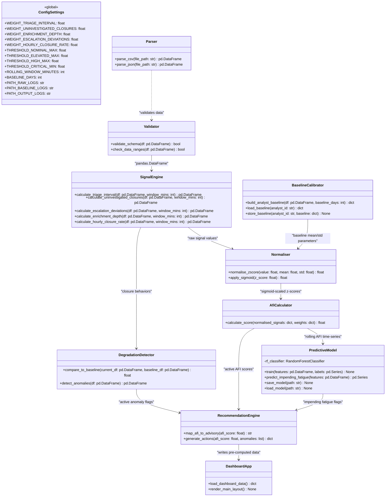
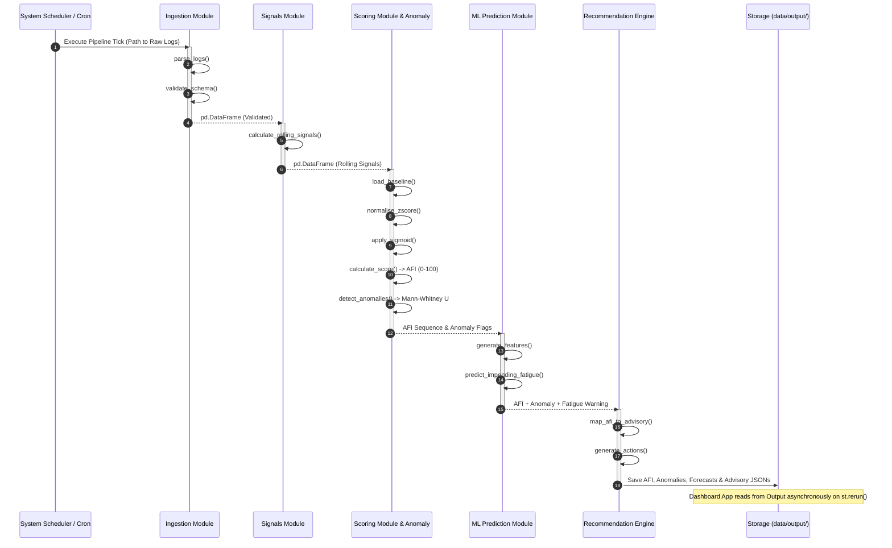

# System UML Diagrams

This document contains the structural and behavioral UML specifications for the **Alert Fatigue Quantifier (AFQ)** system.

---

## 1. Class Diagram

The class diagram below illustrates the attributes, methods, and relationships of the modular classes across the 7 pipeline stages.

---

## 2. Sequence Diagram

The sequence diagram below displays the chronologically ordered call sequence execution at a pipeline processing tick:

